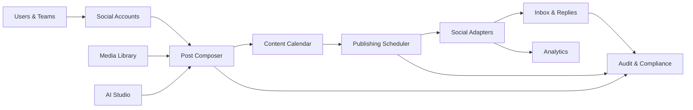
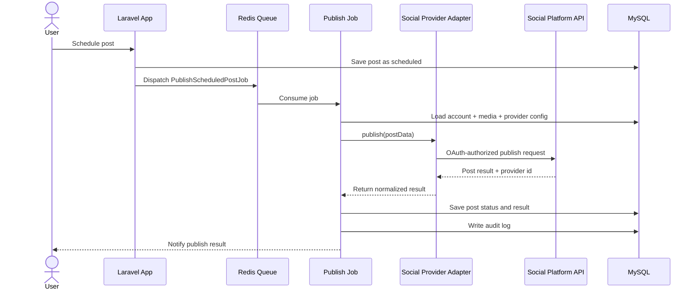
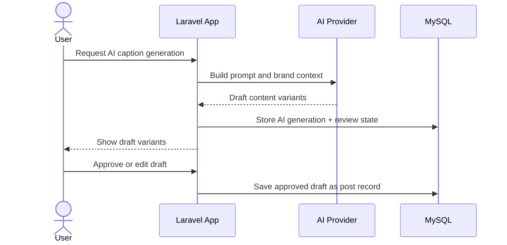
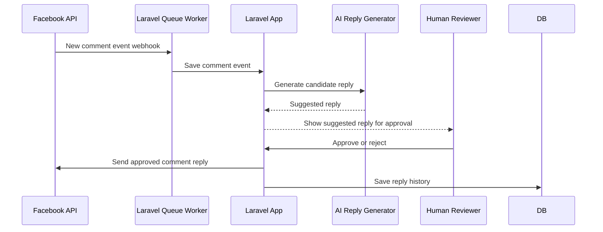

# Social Publishing and Seeding Automation Platform

## 1. Project Summary

Build a Laravel-based social publishing platform for managing social accounts and automating scheduled content publishing across:

- TikTok Global
- Facebook Pages
- Douyin / 抖音
- Optional future integrations such as Instagram, LinkedIn, X, YouTube, Pinterest, Threads

The platform serves as an authorized social media automation and content management system for business workflows, not as a fake-engagement or spam automation tool.

The project should support:

- Social account connection and management
- OAuth token handling and refresh
- Publishing schedules and calendars
- AI-generated content assistance
- Media library and upload validation
- Post approval flows
- Post status tracking
- Comment inbox and moderation
- AI reply suggestions
- Analytics and reporting
- Platform-specific publishing rules
- Audit logs and compliance tracking

## 2. Research Summary

### Relevant GitHub repositories reviewed

| Repository | Why it matters | Notes |
|---|---|---|
| [inovector/mixpost](https://github.com/inovector/mixpost) | Laravel social scheduler reference | Strong PHP/Laravel reference for account management and scheduled publishing |
| [trypostit/trypost](https://github.com/trypostit/trypost) | Modern Laravel social publishing architecture | Good reference for modern Laravel scheduling and social workflow UI |
| [gitroomhq/postiz-app](https://github.com/gitroomhq/postiz-app) | Multi-provider publishing orchestration | Good architecture reference for AI + provider integration |
| [socioboard/Socioboard-5.0](https://github.com/socioboard/Socioboard-5.0) | Social account management and analytics | Useful concept reference, not primary implementation |
| [bytedance/DouyinOpenPlatformDemo](https://github.com/bytedance/DouyinOpenPlatformDemo) | Official Douyin integration reference | Trusted provider reference for Douyin OAuth and publishing approval patterns |

### Safety and risk observations

The project should avoid repositories that:

- Use browser cookies to access social accounts
- Automate login with browser automation to bypass official APIs
- Offer “no API key needed” posting hacks
- Contain password-protected ZIP archives or suspicious binaries
- Rely on hidden private endpoints or undocumented hacks

The safe strategy is to use:

- Official OAuth flows
- Official APIs
- Provider account authorization screens
- Short-lived tokens with refresh support
- Explicit account consent and audit logs

## 3. Confirmed Technology Stack

| Area | Technology |
|---|---|
| Backend | PHP |
| Framework | Laravel |
| Database | MySQL |
| Cache / Queue / lock | Redis |
| Queue dashboard | Laravel Horizon |
| Realtime events | Laravel Reverb |
| Frontend | Inertia.js + Vue 3 |
| Authentication | Laravel Fortify / Sanctum |
| Authorization | Policies + Gates |
| Media storage | S3-compatible object storage |
| Video processing | FFmpeg worker |
| AI provider integration | OpenAI / Anthropic / Gemini / self-hosted model |
| Job scheduling | Laravel Scheduler |
| Testing | Pest or PHPUnit |
| Deployment | Docker Compose |

## 4. Provider Feasibility Summary

### 4.1 TikTok Global

Supported in principle through official provider APIs.

Use cases:

- Connect account via OAuth
- Upload video or image content
- Post captions and hashtags
- Set visibility/privacy options
- Schedule posts
- Retrieve post status
- Track limited analytics and post results

Important caveat:

- Some publishing features require client approval and compliance review.
- Some analytics and comment features are limited or approval-gated.

### 4.2 Facebook Pages

Official API support is strong.

Use cases:

- Page authentication
- Publish page posts
- Schedule content
- Create and moderate comments
- Read page inbox and interactions
- Retrieve page analytics
- Use app review when required

### 4.3 Facebook Groups

Do not plan this as a core supported feature.

Official third-party Group posting is not reliably supported. The project should not rely on hidden or unofficial workflows.

Recommended behavior:

- Do not include automatic Group posting as a guaranteed feature.
- Provide a manual “copy post into group” prompt where appropriate.
- If Meta later exposes a supported integration, add it behind a capability check.

### 4.4 Douyin / 抖音

Supported through official open platform and account approval.

Use cases:

- Account connection and authorization
- Media upload and content publishing
- Status tracking
- Analytics for authorized accounts

Important caveat:

- Requires compliance review and platform approval.
- Content and branding rules are strict.

### 4.5 Comment replies

This should be limited and carefully designed.

Safe and realistic initial support:

- Facebook Page comment inbox
- Approved reply suggestions
- Human approval before sending any automated reply
- Reply rule templates only for supported and approved use cases

Avoid:

- Unapproved TikTok comment auto-replies
- Mass comment spam
- Automated fake engagement
- Spam-like content responses

## 5. Core Business Functions

### 5.1 User/Team Management

- Organization/workspace support
- Team members and roles
- Role-based permissions
- Invite flow
- Account ownership boundaries
- Approval flow for scheduled content

### 5.2 Social Account Management

- Connect multiple accounts per provider
- Track connection status
- Refresh expired tokens
- Audit account changes
- Set account-level publishing limits
- Label accounts by brand, region, or campaign

### 5.3 Media Library

- Upload images and videos
- Organize by campaign or brand
- Validate video duration, resolution, and format
- Thumbnail generation
- Reusable media library
- Duplicate detection

### 5.4 Post Composer

- Text caption editor
- Hashtag support
- Quote, mention, location support where allowed
- Platform-specific variants
- Image/video preview
- Brand voice templates
- Draft/publish/approve flow

### 5.5 AI Studio

- Generate caption ideas
- Rewrite tones and languages
- Create platform-specific variants
- Generate replies to comments
- Summarize performance insights
- Suggest hashtags and hooks
- Keep AI output inside draft workflow until reviewed

### 5.6 Content Calendar

- Daily, weekly, monthly views
- Drag-and-drop rescheduling
- Timezone support
- Campaign assignment
- Publishing queue
- Status filtering

### 5.7 Scheduler and Publisher

- Schedule posts for future times
- Publish through provider adapters
- Retry on API failure
- Rate-limit provider calls
- Idempotency key support
- Outbox pattern for reliability
- Dead-letter queue handling

### 5.8 Engagement Inbox and Reply Automation

- Read comments from connected accounts
- Filter unread or highlighted comments
- Draft or approve a reply
- AI-powered reply suggestions
- Rules for safe reply automation

### 5.9 Analytics and Reporting

- Published posts counts
- Views, engagement, reach where provider exposes them
- Response rates
- Best-performing content time slots
- Campaign-level reporting
- Export CSV or JSON

### 5.10 Audit and Compliance

- Log all publishing operations
- Log token refreshes
- Log AI-generated content approval flow
- Log comment replies
- Log team member actions
- Store compliance-safe metadata

## 6. Product Modules Overview



## 7. Functional Pages and Layout

### 7.1 Dashboard

Route:

```text
/dashboard
```

Widgets:

- Counts by status: scheduled, published, failed, archived
- Accounts connected by provider
- Recent publish history
- Calendar overview
- AI content queue
- Failed jobs summary
- Comment inbox unread count
- Performance summary

### 7.2 Accounts Page

Route:

```text
/accounts
```

Table columns:

- Provider
- Account name
- Username/brand handle
- Status
- Connected since
- Last refresh
- Health status
- Actions

Detail page:

```text
/accounts/{id}
```

Tabs:

- Overview
- Tokens and OAuth status
- Publishing permissions
- Recent posts
- Activity log

### 7.3 Accounts Create/Connect Page

Route:

```text
/accounts/connect
```

Provider flow:

- Choose provider: TikTok, Facebook Page, Douyin
- Redirect to provider OAuth approval page
- Store token securely
- Validate permissions
- Save account and redirect back

### 7.4 Media Library

Route:

```text
/media
```

Features:

- Upload media files
- Drag-and-drop upload area
- Video preview
- Media metadata
- File categorization
- Search and filter
- Reuse in posts

### 7.5 Composer / Post Builder

Routes:

```text
/posts/create
/posts/{id}
```

Sections:

- Platform selector
- Caption editor
- Hashtag suggestions
- Media attachments
- Reply or CTA settings
- Scheduling controls
- Approval and publish controls

### 7.6 AI Studio

Route:

```text
/ai-studio
```

Features:

- Generate caption ideas
- Rewrite in brand tone
- Translate packages
- Generate platform variants
- Suggest hashtags
- Generate reply options
- Generate post hook headlines

### 7.7 Content Calendar

Route:

```text
/calendar
```

Views:

- Month view
- Week view
- Day view
- Grid list

Actions:

- Create new post
- Drag and drop reschedule
- Duplicate content
- Approve or reject schedule

### 7.8 Scheduler and Queue

Route:

```text
/scheduler
```

Shows jobs:

- Scheduled posts
- Publishing queue
- Retry queue
- Failed publish attempts
- Rate-limit states

### 7.9 Comment Inbox

Route:

```text
/inbox
```

Sections:

- Unread comments
- Threads
- Replied comments
- Ignored comments
- Filter by account or platform

Comment thread actions:

- View full thread
- Suggest AI reply
- Approve reply
- Send reply
- Mark as resolved

### 7.10 Analytics

Routes:

```text
/analytics
/analytics/{account_id}
/analytics/campaigns
```

Reports:

- Post reach
- Impressions
- Engagement rate
- Clicks
- Best posting times
- Account comparisons

### 7.11 Audit Log and Compliance

Route:

```text
/audit
```

Shows:

- Publishes
- Token refreshes
- Content approvals
- AI outputs used
- Account changes
- Comment replies

### 7.12 Settings

Routes:

```text
/settings/workspace
/settings/team
/settings/notifications
/settings/integrations
/settings/ai
```

## 8. API Structure

Base URL:

```text
/api/v1
```

Common response:

```json
{
  "success": true,
  "data": {},
  "message": null,
  "errors": []
}
```

### 8.1 Authentication APIs

```http
POST /api/v1/auth/login
POST /api/v1/auth/logout
GET  /api/v1/auth/me
POST /api/v1/auth/refresh
POST /api/v1/auth/2fa/verify
```

### 8.2 Team APIs

```http
GET    /api/v1/teams
POST   /api/v1/teams
GET    /api/v1/teams/{id}
PATCH  /api/v1/teams/{id}
POST   /api/v1/teams/invite
PATCH  /api/v1/team-members/{id}/role
```

### 8.3 Social Account APIs

```http
GET    /api/v1/accounts
POST   /api/v1/accounts/connect
GET    /api/v1/accounts/{id}
PATCH  /api/v1/accounts/{id}
DELETE /api/v1/accounts/{id}
POST   /api/v1/accounts/{id}/refresh-token
POST   /api/v1/accounts/{id}/validate
GET    /api/v1/accounts/{id}/posts
```

### 8.4 Media APIs

```http
GET    /api/v1/media
POST   /api/v1/media/upload
GET    /api/v1/media/{id}
DELETE /api/v1/media/{id}
PATCH  /api/v1/media/{id}
```

### 8.5 Post APIs

```http
GET    /api/v1/posts
POST   /api/v1/posts
GET    /api/v1/posts/{id}
PATCH  /api/v1/posts/{id}
DELETE /api/v1/posts/{id}
POST   /api/v1/posts/{id}/publish-now
POST   /api/v1/posts/{id}/approve
POST   /api/v1/posts/{id}/schedule
POST   /api/v1/posts/{id}/duplicate
```

### 8.6 AI APIs

```http
POST /api/v1/ai/caption
POST /api/v1/ai/variants
POST /api/v1/ai/rewrite
POST /api/v1/ai/hashtags
POST /api/v1/ai/reply-suggestions
```

### 8.7 Calendar APIs

```http
GET /api/v1/calendar
GET /api/v1/calendar/{date}
```

### 8.8 Scheduler APIs

```http
GET   /api/v1/scheduler/jobs
POST  /api/v1/scheduler/jobs/{id}/retry
DELETE /api/v1/scheduler/jobs/{id}
GET   /api/v1/scheduler/failed
```

### 8.9 Inbox APIs

```http
GET    /api/v1/inbox/comments
GET    /api/v1/inbox/comments/{id}
POST   /api/v1/inbox/comments/{id}/reply
POST   /api/v1/inbox/comments/{id}/mark-read
POST   /api/v1/inbox/comments/{id}/resolve
```

### 8.10 Analytics APIs

```http
GET /api/v1/analytics/summary
GET /api/v1/analytics/posts
GET /api/v1/analytics/accounts/{id}
GET /api/v1/analytics/campaigns
```

### 8.11 Audit APIs

```http
GET /api/v1/audit-logs
GET /api/v1/audit-logs/{id}
```

## 9. Key Database Tables

### 9.1 Core tables

```text
users
organizations
organization_user
teams
team_user
roles
permissions
role_user
```

### 9.2 Social account tables

```text
social_accounts
social_account_tokens
social_account_logs
social_provider_capabilities
```

### 9.3 Media tables

```text
media_files
media_file_tags
media_file_versions
```

### 9.4 Post tables

```text
posts
post_variants
post_media
post_comments
post_replies
post_status_history
```

### 9.5 Scheduler tables

```text
scheduled_jobs
job_attempts
job_failures
publish_outbox
```

### 9.6 AI tables

```text
ai_prompts
ai_generations
ai_generation_reviews
brand_voice_profiles
```

### 9.7 Inbox tables

```text
social_comments
comment_replies
comment_rules
```

### 9.8 Audit tables

```text
audit_logs
compliance_events
notification_events
```

## 10. Proposed MySQL Schema (Draft)

```sql
CREATE TABLE social_accounts (
    id BIGINT UNSIGNED AUTO_INCREMENT PRIMARY KEY,
    organization_id BIGINT UNSIGNED NOT NULL,
    provider ENUM('tiktok','facebook_page','douyin','instagram','linkedin','x','youtube') NOT NULL,
    account_name VARCHAR(255) NOT NULL,
    external_account_id VARCHAR(255) NOT NULL,
    username VARCHAR(255) NULL,
    display_name VARCHAR(255) NULL,
    status ENUM('connected','expired','disconnected','error') NOT NULL DEFAULT 'connected',
    oauth_refresh_token_encrypted TEXT NULL,
    oauth_access_token_encrypted TEXT NULL,
    token_expires_at TIMESTAMP NULL,
    metadata JSON NULL,
    created_at TIMESTAMP DEFAULT CURRENT_TIMESTAMP,
    updated_at TIMESTAMP DEFAULT CURRENT_TIMESTAMP ON UPDATE CURRENT_TIMESTAMP,
    INDEX idx_org_provider (organization_id, provider),
    INDEX idx_status (status)
);

CREATE TABLE posts (
    id BIGINT UNSIGNED AUTO_INCREMENT PRIMARY KEY,
    organization_id BIGINT UNSIGNED NOT NULL,
    author_id BIGINT UNSIGNED NOT NULL,
    status ENUM('draft','scheduled','approved','publishing','published','failed','archived') NOT NULL DEFAULT 'draft',
    content TEXT NOT NULL,
    tone VARCHAR(255) NULL,
    scheduling_time TIMESTAMP NULL,
    provider ENUM('tiktok','facebook_page','douyin') NOT NULL,
    media_count INT DEFAULT 0,
    ai_generated BOOLEAN DEFAULT FALSE,
    ai_prompt_id BIGINT UNSIGNED NULL,
    provider_post_id VARCHAR(255) NULL,
    error_message TEXT NULL,
    created_at TIMESTAMP DEFAULT CURRENT_TIMESTAMP,
    updated_at TIMESTAMP DEFAULT CURRENT_TIMESTAMP ON UPDATE CURRENT_TIMESTAMP,
    INDEX idx_org_status (organization_id, status),
    INDEX idx_scheduling_time (scheduling_time)
);

CREATE TABLE social_comments (
    id BIGINT UNSIGNED AUTO_INCREMENT PRIMARY KEY,
    organization_id BIGINT UNSIGNED NOT NULL,
    social_account_id BIGINT UNSIGNED NOT NULL,
    provider ENUM('facebook_page','tiktok','douyin') NOT NULL,
    external_comment_id VARCHAR(255) NOT NULL,
    parent_comment_id VARCHAR(255) NULL,
    author_name VARCHAR(255) NULL,
    author_id VARCHAR(255) NULL,
    message TEXT NOT NULL,
    sentiment VARCHAR(50) DEFAULT 'unknown',
    status ENUM('new','read','replied','resolved','ignored') NOT NULL DEFAULT 'new',
    created_at TIMESTAMP DEFAULT CURRENT_TIMESTAMP,
    updated_at TIMESTAMP DEFAULT CURRENT_TIMESTAMP ON UPDATE CURRENT_TIMESTAMP,
    INDEX idx_status (status),
    INDEX idx_account_provider (social_account_id, provider)
);

CREATE TABLE scheduled_jobs (
    id BIGINT UNSIGNED AUTO_INCREMENT PRIMARY KEY,
    organization_id BIGINT UNSIGNED NOT NULL,
    post_id BIGINT UNSIGNED NOT NULL,
    account_id BIGINT UNSIGNED NOT NULL,
    job_name VARCHAR(255) NOT NULL,
    status ENUM('queued','running','success','failed','retrying','cancelled') NOT NULL DEFAULT 'queued',
    attempt_count INT DEFAULT 0,
    max_attempts INT DEFAULT 5,
    scheduled_at TIMESTAMP NULL,
    run_at TIMESTAMP NULL,
    last_error TEXT NULL,
    created_at TIMESTAMP DEFAULT CURRENT_TIMESTAMP,
    updated_at TIMESTAMP DEFAULT CURRENT_TIMESTAMP ON UPDATE CURRENT_TIMESTAMP,
    INDEX idx_status_run_at (status, run_at),
    INDEX idx_post_id (post_id)
);

CREATE TABLE audit_logs (
    id BIGINT UNSIGNED AUTO_INCREMENT PRIMARY KEY,
    organization_id BIGINT UNSIGNED NOT NULL,
    user_id BIGINT UNSIGNED NULL,
    action VARCHAR(255) NOT NULL,
    resource_type VARCHAR(255) NOT NULL,
    resource_id BIGINT UNSIGNED NULL,
    metadata JSON NULL,
    created_at TIMESTAMP DEFAULT CURRENT_TIMESTAMP,
    INDEX idx_org_created (organization_id, created_at)
);
```

## 11. Sequence Diagrams

### 11.1 Publishing a scheduled post



### 11.2 AI-generated draft approval



### 11.3 Comment reply workflow



## 12. Platform Capability Matrix

| Capability | TikTok Global | Facebook Page | Douyin |
|---|---|---|---|
| OAuth account connection | Yes | Yes | Yes |
| Video upload | Yes | Yes | Yes |
| Image upload | Limited/Platform-specific | Yes | Yes |
| Text-only post | Possible | Yes | Yes |
| Scheduling | Yes, via our scheduler | Yes | Yes |
| Post status polling | Yes | Yes | Yes |
| Comment inbox | Limited / approval-gated | Yes | Limited / approval-gated |
| Auto-reply | Risky / not guaranteed | Yes, with review | Risky / approval-gated |
| Analytics | Limited | Yes | Yes, if approved |
| Group posting | No | Not officially supported | No |

## 13. Security and Compliance Rules

- Use official OAuth flows only
- Store tokens encrypted, not plain text
- Use provider capability checks before showing features
- Keep AI output in draft mode until human approval
- Never mass-reply to comments without explicit approval
- Never create fake engagement or spam behavior
- Never use browser cookies to access accounts
- Never store plaintext social passwords
- Never bypass provider login or approval flows
- Record all publish and reply actions in audit logs
- Add rate limits per provider and account
- Add retries with safe backoff
- Add support for manual override and kill switch

## 14. MVP Scope (Recommended)

### Phase 1

- Organization + team management
- Social account connection manager
- Media library
- Post composer
- Approval workflow
- Content calendar
- Scheduler
- Facebook Page provider adapter
- TikTok provider adapter (official OAuth-published)
- Basic publishing queue
- Basic analytics
- Audit log

### Phase 2

- Douyin provider adapter
- AI caption generation
- AI reply suggestions
- Comment inbox for Facebook pages
- No auto-replies without approval
- Retry logic and alerting

### Phase 3

- Analytics dashboards
- Advanced rate limit and cost controls
- Campaign reporting
- Bulk content scheduling
- Multi-brand workspaces

## 15. Recommended Architecture Decision

Use a clean Laravel + MySQL + Redis architecture inspired by Mixpost and TryPost, with additional provider abstraction and official-OAuth-only flows.

### Recommended implementation pattern

```text
Laravel web app
    -> social account manager
    -> media uploader + validator
    -> post composer + scheduling engine
    -> provider adapters (TikTok, Facebook Page, Douyin)
    -> queue worker for publish jobs
    -> Reverb for realtime updates
    -> Horizon for queue monitoring
    -> MySQL for data state
    -> Redis for cache and job queue
```

## 16. Final Recommendation

The correct product direction is not “mass gambling automation” or a native browser-based account hijack. It is a **compliant social publishing platform** with:

- explicit account authorization
- provider support checks
- human review for AI content and comment replies
- scheduled publishing and queue-based execution
- secure storage of OAuth tokens
- a clear capability matrix per platform

This approach is stable, legally safer, operationally realistic, and aligns with the platform APIs that are actually available.

## 17. Next Step

The next step is to move into Laravel repository scaffolding using this design as the foundation.

Suggested implementation order:

1. Laravel auth and team model
2. Social account model and migration
3. OAuth token storage with encryption
4. Post model and draft workflow
5. Media upload library
6. Scheduler and queue worker
7. Facebook Page adapter
8. TikTok adapter
9. MySQL indexes and audit tables
10. Dashboard pages and API skeleton

This is the safest path to building the product in a way that stays maintainable and compliant.
